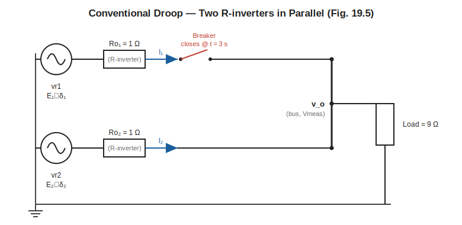
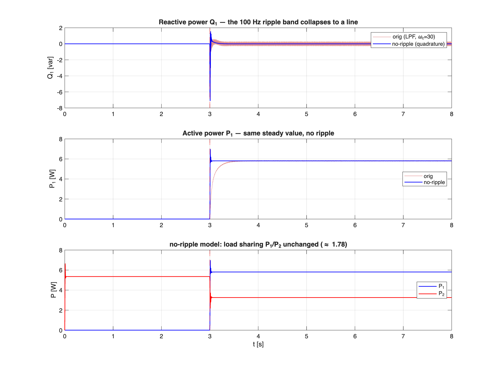

# Conventional Droop Control of Two Parallel R-Inverters

A Simulink/Simscape reproduction of the **conventional droop** experiment from
Zhong & Hornik, *Control of Power Inverters in Renewable Energy and Smart Grid
Integration*, §19.3–19.6 (Fig. 19.5–19.6). Two single-phase inverters with
**resistive output impedance** (R-inverters) share a common resistive load with
**no communication** between them. The model reproduces — and deliberately
exposes — the **load-sharing error** that motivates the robust-droop scheme of §19.6.

| File | Purpose |
|------|---------|
| `conv_droop_2Rinv.slx` | **Original model**: power circuit + two conventional-droop controllers `Ctrl1`, `Ctrl2` (product + LPF power calc) |
| `conv_droop_2Rinv_noripple.slx` | **No-ripple variant**: same circuit, power computed by the quadrature (αβ) method so the 100 Hz ripple cancels — see §5 |
| `run_conv.m` | Simulate the original model (no rebuild) and pop up the 4-panel result figure |
| `build_noripple.m` | Build `…_noripple.slx` from the original by editing the two controllers (original file untouched) |
| `compare_ripple.m` | Run both models and plot the ripple comparison |
| `circuit.svg` | Power-circuit schematic (shown below) |
| `conv_run_results.png` | Original-model result |
| `noripple_compare.png` | Original vs no-ripple comparison (see §5) |

---

## 1. Circuit setup



Each inverter is modelled as an ideal EMF source `vr_i = √2·E_i·sin(θ_i)` behind a
**series output resistance `Ro_i`** — this is what makes it an *R-inverter*. In a
real closed-loop inverter the resistive output impedance is *synthesised* by the
inner current/voltage loop (the book uses a feedback gain `K_i = 4`); here we model
the end result directly as a physical 1 Ω resistor, which is all the
average-value model needs. There is **no LC filter** — per Fig. 19.5 the inverter
is represented as `E∠δ` behind `Ro` only.

```
     Inverter 1 (R-inverter)
   (vr1)──[ Ro1 = 1Ω ]──►I1──/ breaker ──┐         common AC bus
    E1∠δ1                   closes @ t=3s │              v_o
                                          ├───────┬───[ Load 9Ω ]──┐
     Inverter 2 (R-inverter)              │       │                │
   (vr2)──[ Ro2 = 1Ω ]──►I2───────────────┘    (Vmeas)            GND
    E2∠δ2                                                          │
   (both source returns) ──────────────── common neutral ─────────┘
```

**Staged connection.** Inverter 2 is always on. Inverter 1 is switched in by the
**breaker at t = 3 s** (`Connect_cmd`: step 0→1 at t=3). So before 3 s, inverter 2
alone carries the whole load; after 3 s the two run in parallel and must share it.

### Power-circuit parameters

| Symbol | Block | Value | Meaning |
|--------|-------|-------|---------|
| `E*` | `Estar` | 12 V (rms) | Nominal voltage set-point |
| `ω*` | `wstar` | 314.16 rad/s | Nominal frequency (50 Hz) |
| `Ro1`, `Ro2` | `Ro1`,`Ro2` | 1 Ω | Resistive output impedance of each inverter |
| `RL` | `Load` | 9 Ω | Resistive load on the common bus |
| `t_conn` | `Connect_cmd` | 3 s | Time inverter 1 is connected |

### Why resistive output impedance → which droop law

For a source `E∠δ` feeding the bus `V∠0` through a **pure resistance** `Ro`, the power
delivered to the bus is

```
P = ( V·E·cosδ − V² ) / Ro   ≈  V·(E − V) / Ro        (small δ)
Q = ( − V·E·sinδ )   / Ro     ≈  − V·E·δ  / Ro
```

So for an **R-inverter the roles are swapped** versus the textbook inductive case:
**P is set by the voltage difference `(E − V)`**, and **Q is set by the angle `δ`**
(hence by frequency). That is exactly why the droop laws below tie `E` to `P` and
`ω` to `Q`.

---

## 2. The droop controllers (`Ctrl1`, `Ctrl2`)

Both controllers are identical in structure (only the gains differ). Each takes the
**measured bus voltage `vo` and the inverter current `i`** and produces the voltage
reference `vref` fed back to its source.

```
 measured vo, i
   │
   ├─ P path:  p = vo·i ──► [ LPF_P ] ──► P ──►(×n_i)──►(−)─┐
   │                                                        ├─►  E_i = E* − n_i·P_i
   │                                          E* ──────────►(+)─┘        │
   │                                                                     ▼
   │                                                            √2·E_i·sin(θ_i) = vref
   │                                                                     ▲
   └─ Q path:  vo──[delay90]──►vo₉₀ ;  q = vo₉₀·i ──►[ LPF_Q ]──► Q      │
                                          Q ──►(×m_i)──►(+)──► ω_i ──►∫──► θ_i
                                        ω* ───────────────────►(+)
```

**Droop laws (Fig. 19.6 — note: `E` is algebraic, there is no integrator on `E`):**

```
   E_i = E*  −  n_i · P_i          (voltage droops with real power)
   ω_i = ω*  +  m_i · Q_i          (frequency rises with reactive power)
   θ_i = ∫ ω_i dt ,   vref_i = √2 · E_i · sin(θ_i)
```

`vref` is the **instantaneous waveform**, not the amplitude — `E_i` is only its rms
magnitude.

**Reactive power & `delay90`.** A single-phase system has only one voltage and one
current, so `Q` cannot be read off instantaneously. The standard trick is to build a
**fictitious voltage shifted 90°** in time, `vo₉₀`, and compute `Q = ⟨vo₉₀·i⟩`. At
50 Hz a 90° shift is a quarter period, `T/4 = 5 ms`, implemented by the
`delay90` Transport Delay.

### Controller parameters

| Symbol | Block | Inv 1 | Inv 2 | Meaning |
|--------|-------|-------|-------|---------|
| `n_i` | `gain_n` | 0.4 | 0.8 | P→E droop coefficient |
| `m_i` | `gain_m` | 0.1 | 0.2 | Q→ω droop coefficient |

The coefficients are sized so that `n_1·S_1* = n_2·S_2*` (equal *per-unit* droop). With
`n_1:n_2 = 1:2`, inverter 1 is rated for **twice** the power of inverter 2, so the
**intended sharing is `P_1 : P_2 = 2 : 1`**.

---

## 3. Why `LPF_P` and `LPF_Q` are different

```
   LPF_P = 5 / (s + 5)      →  cutoff ωc_P = 5  rad/s
   LPF_Q = 30 / (s + 30)    →  cutoff ωc_Q = 30 rad/s
```

**The problem both filters solve.** Single-phase instantaneous power has an inherent
**2ω = 100 Hz ripple**:

```
   p(t) = vo·i = P − S·cos(2ωt − φ)
```

The DC term is the real power we want; the `cos(2ωt)` term is a 100 Hz oscillation
that must be filtered out. A first-order low-pass `ωc/(s+ωc)` has DC gain 1 (so the
steady-state value is untouched) and attenuates 100 Hz by roughly

```
   |H(j·2ω)| ≈ ωc / (2ω) = ωc / 628 .
```

A **lower `ωc`** → cleaner DC but **slower** response (time constant `τ = 1/ωc`).
So there is a ripple-vs-speed trade-off, and it is **not the same on the two paths**:

| | P path | Q path |
|---|--------|--------|
| Signal route to the waveform | `P → ×n → E_i → √2·sin → vref` | `Q → ×m → ω → ∫ → θ → sin → vref` |
| Does ripple reach the waveform directly? | **Yes** — `E_i` *is* the voltage amplitude | **No** — there is an extra `ω→θ` integrator |
| Extra smoothing at 100 Hz | none | `1/(2ω) ≈ 1/628` from the integrator |
| Filter chosen | **tight** `ωc_P = 5` (≈0.8 % ripple) | **loose** `ωc_Q = 30` (≈4.8 % ripple) |
| Response time `τ = 1/ωc` | 0.20 s | 0.033 s |

**P must be filtered hard.** Any ripple left in `P` lands *one-for-one* in
`E_i = E* − n·P`, i.e. directly on the output-voltage amplitude. So `LPF_P` is tight
(`ωc_P = 5`), giving ≈0.8 % residual 100 Hz on `E_i` — see the very smooth `E_i`
trace in the result figure.

**Q can stay loose.** On the Q path the integrator from `ω` to `θ` adds another
`1/(2ω) ≈ 1/628` of attenuation at 100 Hz — about **21× more** smoothing than the P
path gets. Propagating the residual ripple through:

```
   Δθ ≈ (m · ΔQ_ripple) / (2ω) ≈ 0.1 · 0.3 / 628 ≈ 5×10⁻⁵ rad   →  negligible
```

So the visible ripple band on the `Q` plot (±0.3 var) **does not pollute the output
voltage** — the integrator absorbs it. Because we don't have to filter `Q` hard, we
make `LPF_Q` 6× looser (`ωc_Q = 30`) and buy a **6× faster** reactive-power response.

**In one line:** filter `P` tight because its ripple hits the voltage directly;
let `Q` run loose-and-fast because the `ω→θ` integrator cleans it up for free.

---

## 4. Circuit analysis — why the sharing error appears

Solving the steady state (δ≈0, so the phasors are real: `P_i = V·(E_i − V)/Ro_i`,
the bus node equation `(E1−V)/Ro1 + (E2−V)/Ro2 = V/RL`, closed by the two droop laws)
gives — matching the simulation exactly:

| Quantity | Value |
|----------|-------|
| Bus voltage `Vo` | **9.03 V** rms (12.77 V peak) |
| EMF set-points | `E1 = 9.68 V`, `E2 = 9.39 V` |
| Real power | `P1 = 5.81 W`, `P2 = 3.26 W` |
| **Actual sharing `P1/P2`** | **1.78** |
| **Designed sharing `n2/n1`** | **2.00** |
| **Sharing error** | **≈ 11 %** |
| Voltage droop `(E*−Vo)/E*` | 24.7 % |

### Why `P1/P2 = 1.78` instead of 2.00

Accurate proportional sharing requires the two **droop drops** to be equal:

```
   want:   n1·P1 = n2·P2          (then P1/P2 = n2/n1 = 2 exactly)
   got:    n1·P1 = 2.32  ≠  2.61 = n2·P2      →  ~11 % off
```

The reason is structural. Subtract the two droop laws:

```
   E1 − E2 = n2·P2 − n1·P1
```

For perfect sharing (`n1P1 = n2P2`) we would need `E1 = E2`. **But the two inverters
do not share a common EMF — they share a common *bus* `Vo`**, and the EMFs differ by
the voltage dropped across their output resistances:

```
   Vo = E1 − I1·Ro1 = E2 − I2·Ro2      ⇒      E1 − E2 = I1·Ro1 − I2·Ro2 .
```

Since the two branches carry **different currents** (`I1 ≠ I2`), the drops
`I·Ro` differ even though `Ro1 = Ro2`, so `E1 ≠ E2`, so `n1P1 ≠ n2P2` — a sharing
error is **unavoidable**. The deeper cause: conventional droop feeds `P_i` back
against a **fixed nominal `E*`**, but the quantity that is actually common to both
units is the **real bus voltage `Vo`**, which `E*` does not track. The same blind
spot is why the bus sags 25 % below `E*` (no mechanism restores `Vo`).

### How robust droop (§19.6, Fig. 19.7) fixes it

Replace the algebraic `E` law with an integrator that feeds back the **actual rms bus
voltage**:

```
   Ė_i = K_e·(E* − Vo) − n_i·P_i ,     (K_e = 10)
```

At steady state `Ė_i = 0`, so `K_e·(E* − Vo) = n_i·P_i`. The left side uses `Vo`,
`E*`, `K_e` — all **common to both inverters** — therefore `n1·P1 = n2·P2`
*exactly*, **independent of the `Ro` drops**. That restores `P1/P2 → 2.00` and pulls
`Vo` back toward `E*`. Building that version on the same circuit is the natural next
step.

---

## 5. The `no_ripple` version — quadrature (αβ) power, ripple = 0

The original model filters the 100 Hz (2ω) ripple out of `P` and `Q` with low-pass
filters. As §3 explains, an LPF can only *attenuate* that ripple — it never reaches
exactly zero, and pushing it lower costs response speed. The file
`conv_droop_2Rinv_noripple.slx` removes the ripple **at the source** by changing the
*algorithm*, not by tuning a filter.

### Method — quadrature (αβ) power

Build a 90°-shifted (quadrature) copy of **both** the voltage and the current, then
compute power in the αβ frame:

```
   v_a = vo ,   v_b = vo delayed by T/4   (= delay90,   already in the model)
   i_a = i  ,   i_b = i  delayed by T/4   (= delay90_i, newly added)

   P = ½ ( v_a·i_a + v_b·i_b )
   Q = ½ ( v_b·i_a − v_a·i_b )
```

For a sinusoid the two 2ω terms cancel exactly, so `P` and `Q` come out as pure DC —
no low-pass needed. (Proof for P: the in-phase product carries `VI[cosφ − cos(2ωt−φ)]`
and the quadrature product carries `VI[cosφ + cos(2ωt−φ)]`; their sum is `2·VI·cosφ`,
a constant.)

### Two design details that matter

- **Q path: pure quadrature, no filter.** Reactive power feeds `ω → ∫ → θ`, and that
  integrator (`int_theta`) is a state, so the Q loop is already broken. `LPF_Q` is
  **deleted** entirely.
- **P path: keeps a *high-bandwidth* `LPF_P` (ωc = 300, τ ≈ 3 ms) as a loop-breaker.**
  Active power feeds `E = E* − n·P`, which is purely **algebraic** (the defining feature
  of conventional droop — no integrator on E). Because the resistive `Ro` also makes the
  bus voltage an algebraic function of `vref`, the path `vo → P → E → vref → vo` would
  form an **algebraic loop**. One state breaks it. This `LPF_P` is **not** removing
  ripple (the quadrature cancellation already did — ωc=300 attenuates 100 Hz by only
  ~0.43, nowhere near enough); it is a loop-breaker / band-limiter, so it can be fast.

This asymmetry mirrors the physics: `E = E*−nP` is algebraic → needs a state; `ω = ω*+mQ`
is followed by an integrator → already has one.

### Result (steady window t ∈ [6, 8] s)

| | `P₁` ripple (pk-pk) | `Q₁` ripple (pk-pk) | `P₁/P₂` |
|---|---|---|---|
| Original (LPF) | 0.092 W | 0.554 var | 1.783 |
| **No-ripple (quadrature)** | **0.0000 W** | **0.0000 var** | **1.783** |



The ripple band collapses to a flat line, **and** the steady-state load sharing is
untouched (`P₁/P₂ = 1.78` — the conventional-droop error of §4 is unchanged, because the
quadrature method changes how `P, Q` are *measured*, not the droop physics). Bonus: with
no heavy low-pass in the P path, `P₁` reaches its value almost instantly after the t = 3 s
connection instead of the slow τ = 0.2 s climb of the original (middle panel above).

### Honest caveats

- The T/4 delay is an exact 90° shift only at 50 Hz. Here the steady frequency stays
  essentially at `ω*` (Q ≈ 0), so the shift is essentially exact and the residual is
  negligible.
- At the connection instant the delay blocks carry ~5 ms of stale history, so `P, Q`
  show a brief spike (visible at t = 3 s) before settling to zero ripple.
- "Exactly zero" holds for this **average-value** model (no PWM). A switching model would
  still show high-frequency content from the converter itself.

### Rebuild / run it

```matlab
cd ~/Documents/UniversalDroopControl/ConventionalDroop
build_noripple     % regenerate …_noripple.slx from the original (original untouched)
compare_ripple     % run both models, print ripple metrics, save noripple_compare.png
```

---

## How to run

```matlab
cd ~/Documents/UniversalDroopControl/ConventionalDroop
run_conv          % simulates 8 s and pops up conv_run_results.png
```

The figure shows, top to bottom: output power `P1, P2`; voltage set-points
`E1, E2`; reactive power `Q1, Q2`; and the output voltage zoomed to ~5 line cycles
around the t = 3 s connection.
